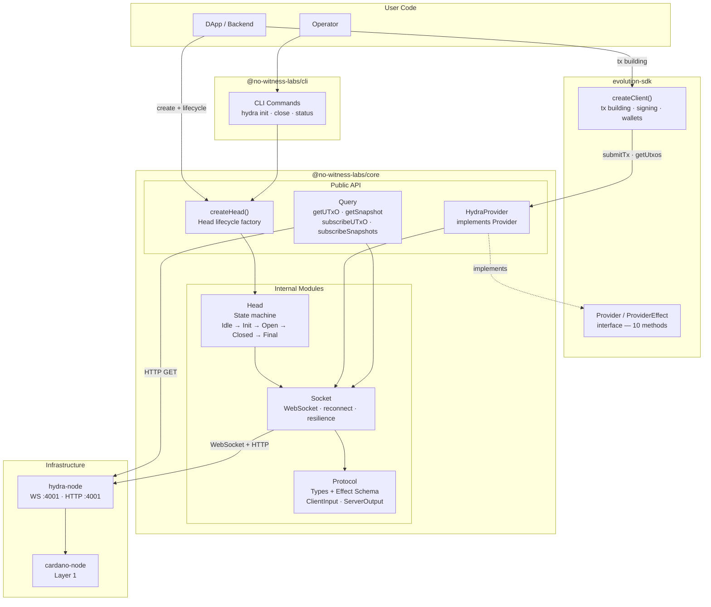

# Hydra SDK — Product Requirements Document

**Version:** 1.0
**Date:** February 16, 2026
**Author:** No Witness Labs
**Status:** Draft

---

## 1. Executive Summary

### Problem Statement

Developers building on Cardano's Hydra Layer 2 must interact directly with a low-level WebSocket/HTTP JSON API exposed by the `hydra-node`. There is no production-grade TypeScript SDK that abstracts the Hydra Head protocol lifecycle, handles connection resilience, provides type-safe message schemas, or integrates with existing Cardano tooling (evolution-sdk, CIP-30 wallets). This forces every team to reimplement the same boilerplate: WebSocket management, message parsing, state machine tracking, and error handling.

### Proposed Solution

A modular, type-safe TypeScript SDK (`@no-witness-labs/hydra-sdk`) that provides:

- A **Protocol module** with Effect Schema-validated types for all Hydra API messages
- A **Socket module** for resilient WebSocket communication with automatic reconnection
- A **Head module** implementing the Hydra Head state machine
- A **`createHead()` factory** as the primary public API for head lifecycle management
- A **Query module** for streaming UTxO, snapshot, and transaction data
- A **HydraProvider** implementing evolution-sdk's `Provider` / `ProviderEffect` interface, enabling existing evolution-sdk code to target Hydra L2 by swapping the provider — no new client API to learn
- A **CLI package** for operators to manage Hydra heads from the terminal

The SDK follows the **Hybrid Effect API pattern** — all logic is implemented in Effect (single source of truth), exposed via an `effect` namespace for composability, and wrapped in Promise-based convenience functions for simplicity.

### Success Criteria

| KPI | Target |
|---|---|
| Full Hydra API message coverage | 100% of `ClientInput` (10 commands) + `ServerOutput` (32 events) typed and validated |
| Head lifecycle integration tests pass | Connect → Init → Commit → Open → NewTx → Close → Fanout |
| Resilience tests pass | Node drop/restart recovery, wallet reconnect |
| Cross-platform test matrix | Chromium, Firefox, WebKit × Linux, Mac, Windows |
| Example projects on testnet | Transfer, Mint/Burn, Simple State Update — all passing |
| npm publish with provenance | Automated via changesets + GitHub Actions |
| Documentation coverage | Getting Started, Providers, Testing, Limits, Production Checklist pages published |

---

## 2. User Experience & Functionality

### User Personas

| Persona | Description | Primary Need |
|---|---|---|
| **DApp Developer** | Building Cardano apps that use Hydra for fast L2 transactions | Simple API to open heads, submit transactions, query state |
| **Hydra Operator** | Running `hydra-node` infrastructure for their team or users | CLI tools and monitoring for head management |
| **SDK Integrator** | Already using evolution-sdk and wants to add L2 support | Drop-in provider that makes evolution-sdk work with Hydra |

### User Stories

#### Story 1: Connect and manage a Hydra Head

> As a **DApp developer**, I want to connect to a Hydra node and manage the head lifecycle so that I can open a head, commit funds, transact at L2 speed, and close the head to settle back on L1.

**Acceptance Criteria:**

- `createHead({ url: 'ws://localhost:4001' })` establishes a WebSocket connection and returns a typed head instance
- `head.init()`, `head.commit(utxos)`, `head.close()`, `head.safeClose()`, `head.fanout()`, `head.abort()` execute lifecycle commands
- `head.subscribe(callback)` streams real-time state changes (`HeadIsInitializing`, `HeadIsOpen`, `HeadIsClosed`, etc.)
- `head.getState()` returns the current `HeadStatus` synchronously
- Both Promise and Effect APIs are available (`head.init()` and `head.effect.init()`)
- Connection auto-reconnects with exponential backoff on disconnect

**Usage:**

```typescript
// Promise API
import * as Hydra from '@no-witness-labs/hydra-sdk'

const head = await Hydra.Head.create({ url: 'ws://localhost:4001' })
head.subscribe((event) => console.log(event.tag, event))
await head.init({ contestationPeriod: 60 })
await head.commit(utxos)
// ... head is open, transact ...
await head.close()
await head.fanout()
await head.dispose()

// Effect API
const program = Effect.gen(function* () {
  const head = yield* Hydra.Head.effect.create({ url: 'ws://localhost:4001' })
  yield* head.effect.init({ contestationPeriod: 60 })
  yield* head.effect.commit(utxos)
  // ... transact ...
  yield* head.effect.close()
  yield* head.effect.fanout()
})
await Hydra.Runtime.runEffectPromise(program)

// Effect DI
const HeadLayer = Hydra.Head.layer({ url: 'ws://localhost:4001' })
const program = Effect.gen(function* () {
  const head = yield* Hydra.Head.HydraHeadService
  yield* head.effect.init({ contestationPeriod: 60 })
})
await Effect.runPromise(program.pipe(Effect.provide(HeadLayer)))
```

#### Story 2: Submit L2 transactions via evolution-sdk

> As a **DApp developer**, I want to build and submit transactions inside an open Hydra Head using my existing evolution-sdk code so that I get near-instant confirmation without L1 fees and without learning a new API.

**Acceptance Criteria:**

- `Hydra.Provider.create(head)` returns a `Provider` / `ProviderEffect` that targets L2
- Plugging HydraProvider into `Evolution.createClient({ provider: hydraProvider, wallet })` gives a full tx builder targeting L2
- `submitTx()` sends the transaction via WebSocket `NewTx` message
- `TxValid` / `TxInvalid` responses are surfaced with typed error information
- `awaitTx(txHash)` resolves when the tx appears in a `SnapshotConfirmed` event
- Existing evolution-sdk tx building, signing, and UTxO selection work unchanged

**Usage:**

```typescript
// Create HydraProvider from an open head
const hydraProvider = Hydra.Provider.create(head)

// Plug into evolution-sdk — same API as L1
const l2Client = Evolution.createClient({ provider: hydraProvider, wallet })
const hash = await l2Client.newTx()
  .payToAddress({ address, assets: Assets.fromLovelace(5_000_000n) })
  .build()
  .sign()
  .submit()  // → HydraProvider → WebSocket NewTx

// Wait for L2 confirmation (async iterator)
for await (const snapshot of head.subscribeSnapshots()) {
  if (snapshot.confirmedTransactions.includes(hash)) break
}

// Or via provider
await hydraProvider.awaitTx(hash)

// Effect API
yield* hydraProvider.Effect.submitTx(signedTx)
yield* hydraProvider.Effect.awaitTx(hash)
```

#### Story 3: Query head state and UTxOs

> As a **DApp developer**, I want to query the current UTxO set and snapshot state of an open head so that I can display balances and build transactions.

**Acceptance Criteria:**

- `getUTxO()` returns the confirmed UTxO set
- `getSnapshot()` returns the latest confirmed snapshot
- `subscribeUTxO()`, `subscribeSnapshots()`, `subscribeTransactions()` provide real-time streaming via Effect PubSub (Effect API) or `AsyncIterableIterator` (Promise API)
- UTxO filtering by address is supported

**Usage:**

```typescript
// One-shot queries (Promise)
const utxo = await Hydra.Query.getUTxO(head)
const snapshot = await Hydra.Query.getSnapshot(head)
const params = await Hydra.Query.getProtocolParameters(head)

// One-shot queries (Effect)
const utxo = yield* Hydra.Query.effect.getUTxO(head)

// Streaming — callback (fire-and-forget)
const unsub = head.subscribe((event) => {
  if (event.tag === 'SnapshotConfirmed') updateUI(event.snapshot)
})

// Streaming — async iterator (control flow)
for await (const utxo of Hydra.Query.subscribeUTxO(head)) {
  updateBalance(utxo)
}

// Streaming — Effect Stream (composition)
const snapshots: Stream.Stream<Snapshot, QueryError> =
  Hydra.Query.effect.subscribeSnapshots(head)
```

#### Story 4: Use evolution-sdk against Hydra L2

> As an **SDK integrator**, I want to use my existing evolution-sdk code against a Hydra head by simply swapping the provider.

**Acceptance Criteria:**

- `HydraProvider` implements evolution-sdk's `Provider` interface (Promise API) and exposes `.Effect: ProviderEffect` (Effect API)
- Swapping to `HydraProvider` allows existing evolution-sdk code to target L2 with no other changes
- All 10 Provider methods are implemented: 7 fully supported, `getDelegation()` and `evaluateTx()` throw `ProviderError` (not applicable on L2), `getDatum()` is best-effort
- Provider swap workflow is documented (L1 → L2 → L1)

**Usage:**

```typescript
// L1 workflow — using Blockfrost
const l1Provider = new Evolution.Blockfrost('preview', apiKey)
const l1Client = Evolution.createClient({ provider: l1Provider, wallet })

// L2 workflow — swap provider, everything else identical
const hydraProvider = Hydra.Provider.create(head)
const l2Client = Evolution.createClient({ provider: hydraProvider, wallet })

// Same code works on both — only the provider changed
const utxos = await l2Client.provider.getUtxos(address)
const hash = await l2Client.newTx()
  .payToAddress({ address, assets })
  .build().sign().submit()

// Effect API — same dual pattern as all evolution-sdk providers
const utxos = yield* hydraProvider.Effect.getUtxos(address)
const hash = yield* hydraProvider.Effect.submitTx(signedTx)
```

#### Story 5: Manage heads from the CLI

> As a **Hydra operator**, I want to connect to a node, inspect head status, and trigger lifecycle operations from the command line.

**Acceptance Criteria:**

- `hydra connect ws://node:4001` connects to a node
- `hydra status` shows current head state, participants, UTxO summary
- `hydra init`, `hydra close`, `hydra fanout` trigger lifecycle commands
- `--json` flag outputs machine-readable JSON
- Config precedence: CLI flags > env vars (`HYDRA_*`) > config file > defaults

#### Story 6: Resilient production deployment

> As a **DApp developer**, I want the SDK to handle network failures gracefully so that my application recovers without manual intervention.

**Acceptance Criteria:**

- Temporary disconnects trigger automatic reconnect with exponential backoff + jitter
- State is consistent after reconnection (replays history via `?history=yes`)
- `hydra-node` restart triggers SDK reconnect and state recovery
- Configurable retry policies (max retries, backoff factor, timeout)
- Connection health metrics are available

**Usage:**

```typescript
// Promise API — configure retry policy
const head = await Hydra.Head.create({
  url: 'ws://node:4001',
  reconnect: {
    maxRetries: 10,
    backoffFactor: 1.5,
    initialDelay: 1000,
    maxDelay: 30_000,
  },
  historyOnReconnect: true,
})

// Effect API — compose with Effect retry/timeout
const resilientHead = Hydra.Head.effect.createScoped(config).pipe(
  Effect.retry({ times: 5 }),
  Effect.timeout('30 seconds'),
)
```

### Non-Goals

- **Running a `hydra-node`** — the SDK is a client, not a node implementation
- **Cardano L1 provider implementation** — L1 providers come from evolution-sdk
- **Custodial key management** — Hydra keys remain on the client side
- **Multi-head management per node** — single head per `hydra-node` (Hydra protocol constraint)
- **Protocol-level changes** — the SDK wraps the existing Hydra Head protocol as-is
- **Mobile-native SDKs** — TypeScript/JavaScript only (works in React Native via JS engine)

---

## 3. Technical Specifications

### Architecture Overview



### Module Breakdown

#### Protocol Module (`packages/core/src/Protocol/`)

**Purpose:** Type definitions and Effect Schema validators for all Hydra API messages.

**Coverage (from Hydra API v1.2.0):**

| Category | Messages |
|---|---|
| **ClientInput (10 commands)** | `Init`, `Abort`, `NewTx`, `Recover`, `Decommit`, `Close`, `SafeClose`, `Contest`, `Fanout`, `SideLoadSnapshot` |
| **ServerOutput (32 events)** | `HeadIsInitializing`, `Committed`, `HeadIsOpen`, `HeadIsClosed`, `HeadIsContested`, `ReadyToFanout`, `HeadIsAborted`, `HeadIsFinalized`, `TxValid`, `TxInvalid`, `SnapshotConfirmed`, `SnapshotSideLoaded`, `DecommitRequested`, `DecommitApproved`, `DecommitFinalized`, `DecommitInvalid`, `CommitRecorded`, `CommitApproved`, `CommitFinalized`, `CommitRecovered`, `DepositActivated`, `DepositExpired`, `EventLogRotated`, `NetworkConnected`, `NetworkDisconnected`, `NetworkVersionMismatch`, `NetworkClusterIDMismatch`, `PeerConnected`, `PeerDisconnected`, `IgnoredHeadInitializing`, `NodeUnsynced`, `NodeSynced` |
| **Greetings (connection)** | `Greetings` — separate message type sent on WebSocket connect (contains `me`, `headStatus`, `hydraHeadId`, `snapshotUtxo`, `hydraNodeVersion`, `env`, `networkInfo`, `chainSyncedStatus`, `currentSlot`) |
| **ClientMessage (errors)** | `CommandFailed`, `PostTxOnChainFailed`, `RejectedInputBecauseUnsynced`, `SideLoadSnapshotRejected` |
| **InvalidInput (parse errors)** | `InvalidInput` — separate message type sent when WebSocket input cannot be decoded (contains `reason`, `input`) |
| **Domain types** | `HeadId`, `HeadSeed`, `Party`, `Snapshot`, `SnapshotNumber`, `UTxO`, `TxIn`, `TxOut`, `Transaction`, `Value`, `Address`, `HeadStatus`, `HeadState`, `ContestationPeriod`, `ProtocolParameters` |

**Remaining tasks (Issue #30):**

- Make some response fields optional
- Verify `Schema.DateTimeUtcFromDate` correctness
- Proper Schema for response UTxOs
- Verify integer types in Schemas
- Comprehensive negative tests

#### Socket Module (`packages/core/src/Socket/`)

**Purpose:** WebSocket connection management with resilience.

**Capabilities:**

- Connect to `hydra-node` WebSocket (`ws://` or `wss://`)
- Send typed `ClientInput` messages
- Receive and decode typed `ServerOutput` / `ClientMessage` messages
- Automatic reconnection with exponential backoff + jitter
- Query parameter configuration: `?history=yes|no`, `?snapshot-utxo=yes|no`, `?address=<bech32>`
- Browser (native `WebSocket`) and Node.js (`ws` or `undici`) compatibility
- Connection state tracking and health monitoring

**Four API surfaces:**

```typescript
// 1. Internal Effect (private, source of truth)
function connectEffect(config: SocketConfig): Effect.Effect<HydraSocket, SocketError> { ... }

// 2. effect namespace (public)
export const effect = {
  connect: connectEffect,
  connectScoped: (config: SocketConfig) =>
    Effect.acquireRelease(connectEffect(config), (s) => closeEffect(s).pipe(Effect.orDie)),
  send: sendEffect,
  receive: receiveStream,
}

// 3. Promise API (public)
export async function connect(config: SocketConfig): Promise<HydraSocket> { ... }
export async function send(socket: HydraSocket, msg: ClientInput): Promise<void> { ... }

// 4. Effect DI (Layer)
export class HydraSocketService extends Context.Tag('HydraSocketService')<
  HydraSocketService, HydraSocket
>() {}

export function layer(config: SocketConfig): Layer.Layer<HydraSocketService, SocketError> {
  return Layer.scoped(HydraSocketService, effect.connectScoped(config))
}
```

#### Head Module (`packages/core/src/Head/` — internal)

**Purpose:** State machine tracking Hydra Head lifecycle transitions.

**States:** `Idle` → `Initializing` → `Open` → `Closed` → `FanoutPossible` → `Final`

**Also handles:** `Idle` → `Initializing` → `Aborted` (abort path)

**Transitions driven by:** `ServerOutput` events from the WebSocket

#### `createHead()` Factory (`packages/core/src/createHead/` — public API)

**Purpose:** Primary entry point for head lifecycle management. Exposes all four API surfaces.

**Promise API:**

```typescript
const head = await Hydra.Head.create({ url: 'ws://localhost:4001' })
await head.init({ contestationPeriod: 60 })
await head.dispose() // manual cleanup
```

**Effect API (scoped — recommended):**

```typescript
const program = Effect.scoped(
  Effect.gen(function* () {
    const head = yield* Hydra.Head.effect.createScoped({ url: 'ws://localhost:4001' })
    yield* head.effect.init({ contestationPeriod: 60 })
    // connection auto-closes when scope ends
  })
)
```

**Effect API (unscoped — escape hatch):**

```typescript
const head = yield* Hydra.Head.effect.create(config)
// ... long-lived usage ...
yield* head.effect.dispose()
```

**Effect DI (Layer — production):**

```typescript
export class HydraHeadService extends Context.Tag('HydraHeadService')<
  HydraHeadService, HydraHead
>() {}

export function layer(config: HeadConfig): Layer.Layer<HydraHeadService, HeadError> {
  return Layer.scoped(HydraHeadService, effect.createScoped(config))
}

// Usage:
const program = Effect.gen(function* () {
  const head = yield* HydraHeadService
  yield* head.effect.init({ contestationPeriod: 60 })
})
await Effect.runPromise(program.pipe(Effect.provide(Head.layer(config))))
```

**Resource management:** `create()` acquires a WebSocket connection. Cleanup via:

- `head.dispose()` / `Symbol.asyncDispose` — manual close (Promise API, long-lived)
- `withHead(config, body)` — bracket pattern (Promise API, scoped)
- `effect.createScoped(config)` — `acquireRelease` (Effect API, **recommended**)
- `layer(config)` — Layer lifecycle (Effect DI, **recommended for production**)

#### Query Module (`packages/core/src/Query/` — public API)

**Purpose:** Read-only queries and streaming subscriptions.

| Function | Source | Description |
|---|---|---|
| `getUTxO()` | `GET /snapshot/utxo` | Current confirmed UTxO set |
| `getSnapshot()` | `GET /snapshot` | Latest confirmed snapshot |
| `getHeadState()` | `GET /head` | Current head state detail |
| `getProtocolParameters()` | `GET /protocol-parameters` | Cardano protocol params |
| `getPendingDeposits()` | `GET /commits` | Pending deposit tx IDs |
| `getSeenSnapshot()` | `GET /snapshot/last-seen` | Latest seen (unconfirmed) snapshot |
| `getHeadInitialization()` | `GET /head-initialization` | Timestamp of last head initialization |
| `subscribeUTxO()` | WebSocket `SnapshotConfirmed` | Stream UTxO changes |
| `subscribeSnapshots()` | WebSocket `SnapshotConfirmed` | Stream confirmed snapshots |
| `subscribeTransactions()` | WebSocket `TxValid` | Stream transaction confirmations |

**Streaming in Promise API:** `AsyncIterableIterator<T>`
**Streaming in Effect API:** `Stream.Stream<T, E>`

#### HydraProvider (`packages/core/src/HydraProvider/`)

**Purpose:** evolution-sdk `Provider` / `ProviderEffect` adapter targeting Hydra L2.

evolution-sdk uses a dual API pattern: each provider class implements `Provider` (Promise-based) and exposes a `.Effect: ProviderEffect` property (Effect-based, 10 methods). HydraProvider follows this same pattern, aligning with the SDK's Hybrid Effect API architecture.

Maps evolution-sdk Provider interface methods to Hydra APIs:

| Provider Method | Hydra Implementation | Notes |
|---|---|---|
| `getProtocolParameters()` | `GET /protocol-parameters` | Fully supported — returns Cardano protocol params used by L2 ledger |
| `getUtxos(address)` | `GET /snapshot/utxo` (filtered by address) | Fully supported — filters confirmed snapshot UTxO |
| `getUtxosWithUnit(address, unit)` | `GET /snapshot/utxo` (filtered by address + unit) | Fully supported — additional client-side asset filtering |
| `getUtxoByUnit(unit)` | `GET /snapshot/utxo` (filtered by unit) | Fully supported — scan confirmed UTxO for specific asset |
| `getUtxosByOutRef(outRefs)` | `GET /snapshot/utxo` (filtered by OutRef) | Fully supported — client-side OutRef matching |
| `getDelegation(rewardAddress)` | N/A | **Not supported on L2** — delegation/staking is L1-only. Returns empty/throws `ProviderError` |
| `getDatum(datumHash)` | `GET /snapshot/utxo` (scan for datum hash) | **Best-effort** — can scan UTxO for inline datums; datum-hash-only UTxOs may not be fully resolvable on L2 |
| `awaitTx(txHash, checkInterval?)` | WebSocket `SnapshotConfirmed` | Fully supported — resolves when tx appears in a confirmed snapshot |
| `submitTx(tx)` | WebSocket `NewTx` or `POST /transaction` | Fully supported — submits signed tx to head |
| `evaluateTx(tx)` | N/A | **Not supported on L2** — Hydra has no tx evaluation endpoint. Returns estimated ex-units or throws `ProviderError` |

#### CLI Package (`packages/cli/`)

**Purpose:** Operator CLI using `@effect/cli`.

| Command | Description |
|---|---|
| `hydra connect <url>` | Connect to a hydra-node |
| `hydra status` | Show head state, participants, UTxO summary |
| `hydra init` | Initialize a new head |
| `hydra commit <utxo-file>` | Commit UTxOs to initializing head |
| `hydra close` | Close the head |
| `hydra fanout` | Fan out after contestation |
| `hydra abort` | Abort before all commits |
| `hydra config` | Show/set configuration |

Config precedence: CLI flags > `HYDRA_*` env vars > `~/.config/hydra-sdk/config.json` > defaults

### Hydra Node API Mapping

The SDK wraps both WebSocket and HTTP interfaces of the `hydra-node` (API v1.2.0):

**WebSocket (`ws://{host}:{port}/`):**

| Direction | Operation | SDK Method |
|---|---|---|
| PUB (send) | `Init` | `head.init()` |
| PUB | `Abort` | `head.abort()` |
| PUB | `NewTx` | `head.submitTx()` / `provider.submitTx()` |
| PUB | `Recover` | `head.recover(txId)` |
| PUB | `Decommit` | `head.decommit(tx)` |
| PUB | `Close` | `head.close()` |
| PUB | `SafeClose` | `head.safeClose()` |
| PUB | `Contest` | `head.contest()` |
| PUB | `Fanout` | `head.fanout()` |
| PUB | `SideLoadSnapshot` | `head.sideLoadSnapshot(snapshot)` |
| SUB (receive) | `Greetings` | Connection metadata |
| SUB | `HeadIsInitializing` | State transition event |
| SUB | `Committed` | State transition event |
| SUB | `HeadIsOpen` | State transition event |
| SUB | `HeadIsClosed` | State transition event |
| SUB | `HeadIsContested` | State transition event |
| SUB | `ReadyToFanout` | State transition event |
| SUB | `HeadIsAborted` | State transition event |
| SUB | `HeadIsFinalized` | State transition event |
| SUB | `TxValid` / `TxInvalid` | Transaction result |
| SUB | `SnapshotConfirmed` | Snapshot finality |
| SUB | `Decommit*` events | Decommit lifecycle |
| SUB | `Commit*` events | Incremental commit lifecycle |
| SUB | `Network*` / `Peer*` | Network health |
| SUB | `NodeUnsynced` / `NodeSynced` | Node sync status |
| SUB | `CommandFailed` / `RejectedInputBecauseUnsynced` | Error handling |

**HTTP (`http://{host}:{port}/`):**

| Method | Path | SDK Method |
|---|---|---|
| `GET` | `/head` | `query.getHeadState()` |
| `GET` | `/snapshot` | `query.getSnapshot()` |
| `GET` | `/snapshot/utxo` | `query.getUTxO()` |
| `GET` | `/snapshot/last-seen` | `query.getSeenSnapshot()` |
| `GET` | `/protocol-parameters` | `query.getProtocolParameters()` |
| `GET` | `/commits` | `query.getPendingDeposits()` |
| `GET` | `/head-initialization` | `query.getHeadInitialization()` |
| `POST` | `/commit` | `head.commit(utxo)` (draft commit tx) |
| `POST` | `/decommit` | `head.decommit(tx)` |
| `POST` | `/transaction` | `head.submitTx(tx)` / `provider.submitTx(tx)` |
| `POST` | `/cardano-transaction` | internal (`head.commit()` flow) |
| `POST` | `/snapshot` | `head.sideLoadSnapshot(req)` |
| `DELETE` | `/commits/{tx-id}` | `head.recover(txId)` |

### Integration Points

| System | Integration | Method |
|---|---|---|
| `hydra-node` | WebSocket + HTTP API | Primary interface |
| evolution-sdk | `HydraProvider` + L1 providers | Transaction building |
| CIP-30 wallets | Via evolution-sdk wallet module | Transaction signing (Nami, Eternl, Lace, etc.) |
| Cardano L1 | Via evolution-sdk providers | Blockfrost, Kupmios, Koios, Maestro |

### Security & Privacy

- **No custodial keys:** Hydra signing keys remain client-side. The SDK never stores or transmits private keys
- **TLS support:** `wss://` and `https://` for encrypted node communication (configured via `hydra-node` `--tls-cert` / `--tls-key`)
- **API unauthenticated:** The `hydra-node` API has no built-in auth. Users must secure access via network-level controls (firewall, VPN, reverse proxy). The SDK documents this clearly
- **Input validation:** All received messages validated against Effect Schema before processing — prevents malformed data from corrupting state
- **No telemetry:** SDK collects zero usage data

### Error Handling (Hybrid API Pattern)

All errors extend `Data.TaggedError` from Effect:

```typescript
// Error definitions
export class SocketError extends Data.TaggedError('SocketError')<{
  readonly cause: unknown
  readonly message: string
}> {}

export class HeadError extends Data.TaggedError('HeadError')<{
  readonly cause: unknown
  readonly message: string
}> {}

export class ProtocolError extends Data.TaggedError('ProtocolError')<{
  readonly cause: unknown
  readonly message: string
}> {}

// Effect API — errors in type signature
function initEffect(): Effect.Effect<void, HeadError | SocketError> { ... }

// Promise API — errors thrown, documented with @throws
/** @throws {HeadError} When head is in wrong state
  * @throws {SocketError} When connection fails */
export async function init(): Promise<void> { ... }
```

---

## 4. Technology Stack & Constraints

| Component | Technology | Rationale |
|---|---|---|
| Language | TypeScript 5.9+ (strict mode) | Type safety, ecosystem |
| Runtime | ES2022, ESM-only | Modern targets, no CJS legacy |
| Effect library | Effect | Composition, error handling, DI (per Hybrid API pattern) |
| Schema validation | `effect/Schema` | Runtime type validation for protocol messages (part of main `effect` package since v3.10) |
| WebSocket | Native `WebSocket` (browser) / `ws` (Node.js) | Cross-platform |
| Cardano tooling | evolution-sdk | L1 providers, wallet integration, tx building |
| CLI framework | `@effect/cli` | Declarative CLI with Effect integration |
| Monorepo | pnpm workspaces + Turborepo | Fast builds, caching |
| Testing | Vitest + Playwright | Unit + cross-browser testing |
| Documentation | Fumadocs | MDX docs with Twoslash code examples |
| Versioning | Changesets | Automated releases |
| CI/CD | GitHub Actions | Build, test, publish pipeline |

### Platform Requirements

| Platform | Requirement |
|---|---|
| Node.js | >= 20 |
| Browsers | Chromium (latest-1), Firefox (latest-1), WebKit (latest-1) |
| OS | Linux, macOS, Windows |

---

## 5. Risks & Roadmap

### Phased Rollout

#### Milestone 1 — Foundation (Completed/In Progress)

**Goal:** Core infrastructure, protocol types, WebSocket layer, head state machine.

| Deliverable | Status | Issue |
|---|---|---|
| Package structure & build config | Done | #2 |
| Protocol module — message types & schemas | Done (refinements in #30) | #3 |
| Socket module — WebSocket communication | Done | #4 |
| Head state machine (internal) | Done | #5 |
| `createHead()` factory function | In Progress | #6 |
| Documentation site setup | Open | #7 |

#### Milestone 2 — Transaction & Query Layer

**Goal:** L1/L2 transaction API, query module, examples, integration tests.

| Deliverable | Issue |
|---|---|
| Query module — head state & UTxO queries with streaming | #8 |
| HydraProvider — evolution-sdk Provider implementation | #9 |
| Example projects (transfer, mint/burn, state update) | #10 |
| CLI package setup with @effect/cli | #11 |
| Complete head lifecycle integration tests | #12 |

#### Milestone 3 — Integration & Resilience

**Goal:** evolution-sdk integration, cross-platform testing, production resilience.

| Deliverable | Issue |
|---|---|
| Provider integration documentation | #13 |
| Cross-browser & cross-platform testing suite | #14 |
| HydraProvider — evolution-sdk provider implementation | #15 |
| Connection resilience & recovery | #16 |

#### Milestone 4 — Release & Documentation

**Goal:** npm publish, complete docs, grant closeout.

| Deliverable | Issue |
|---|---|
| npm release automation | #17 |
| Complete documentation | #18 |
| Grant closeout report | #19 |

#### Future — hydra-manager-sdk

| Deliverable | Issue |
|---|---|
| hydra-manager-sdk (multi-head orchestration) | #23 |

### Technical Risks

| Risk | Impact | Likelihood | Mitigation |
|---|---|---|---|
| **Hydra API breaking changes** | Protocol module requires updates | Medium | Pin to specific `hydra-node` version in tests; Schema validation catches mismatches early |
| **evolution-sdk Provider interface changes** | HydraProvider adapter breaks | Low | Depend on stable evolution-sdk version; integration tests in CI |
| **WebSocket reliability in browsers** | Dropped connections lose state | Medium | Exponential backoff + history replay on reconnect; offline queue for pending ops |
| **Hydra protocol limitations** | SDK cannot work around protocol constraints (single head per node, static topology, training wheels) | N/A | Document clearly in "Limits" guide; set user expectations |
| **Cross-browser WebSocket differences** | Safari/Firefox edge cases | Low | Playwright test matrix across Chromium/Firefox/WebKit |
| **Large UTxO sets** | Memory pressure in browser | Low | Pagination support; streaming instead of full materialization |

### Dependencies

| Dependency | Version | Purpose |
|---|---|---|
| `hydra-node` | >= 1.0.0 (tested against 1.2.0) | Target node API version |
| `effect` | >= 3.10 | Core runtime incl. `effect/Schema` (peer dependency) |
| `@effect/cli` | >= 0.x | CLI framework |
| evolution-sdk (`@intersectmbo/evolution-sdk`) | TBD | L1 providers + wallet + tx building |

---

## 6. Testing Strategy

### Unit Tests (Vitest)

- Protocol schema validation (positive + negative cases)
- Head state machine transitions (all valid/invalid paths)
- Socket reconnection logic
- `createHead()` / HydraProvider with mocked WebSocket

### Integration Tests (Vitest + Docker)

- Full head lifecycle against dockerized `hydra-node`
- Multi-party head with multiple SDK instances
- Reconnection after node restart
- L1 ↔ L2 commit/fanout flows

### Cross-Browser Tests (Playwright)

- Chromium, Firefox, WebKit
- WebSocket connection + message exchange
- Wallet extension interaction (Nami, Eternl, Lace)

### Platform Tests (CI Matrix)

- Linux (Ubuntu latest), macOS (latest), Windows (latest)

### Testnet Validation

- Example projects run on Cardano `preview` testnet
- Transfer, Mint/Burn, State Update — all produce on-chain evidence

---

## Appendix: Hybrid API Pattern — Four Surfaces

Per the project's architectural decision ([hybrid-effect-api.instructions.md](/.github/instructions/hybrid-effect-api.instructions.md)) and aligned with the [midday-sdk](https://github.com/no-witness-labs/midday-sdk) pattern (ADR-001: Dual API Pattern):

### Architecture Decisions

**Decision 1: Four API surfaces per module**

Every module exposes the same operation through four complementary surfaces. Rationale: the SDK manages stateful WebSocket connections — DI/Layers provide testable lifecycle management without leaking Effect concepts to Promise users.

- **Internal Effect** — private `*Effect()` functions, single source of truth
- **`effect` namespace** — public, zero-overhead re-export for Effect users
- **Promise API** — public, `async function` wrappers for most users
- **Effect DI** — `Context.Tag` + `Layer.scoped` for production apps and testing

**Decision 2: Instance handles with `.effect` sub-namespace**

Stateful objects (Head, Socket) carry both Promise methods and an `effect` property with Effect methods. Rationale: discoverable via autocomplete, consistent with midday-sdk, avoids separate module-level functions for instance operations.

**Decision 3: Scoped by default, three streaming patterns**

Effect API uses `acquireRelease` — connection auto-closes when Scope ends. Promise API uses manual `dispose()` or bracket `withHead()`. Streaming uses callbacks (fire-and-forget), `AsyncIterableIterator` (control flow), and `Stream.Stream` (Effect composition).

### Implementation Rules

| # | Rule | Key Point |
|---|---|---|
| 1 | **Implementation lives in Effect** | Single source of truth. Every operation is a private Effect function. Exception: pure hot-path functions |
| 2 | **`effect` namespace re-exports directly** | Zero-overhead: `export const effect = { create: createEffect }`. No wrapping |
| 3 | **Promise API runs the Effect** | Sync → `runEffect()`, Async → `runEffectPromise()` |
| 4 | **Instance handles have `.effect` sub-namespace** | `head.init()` (Promise) and `head.effect.init()` (Effect) share the same implementation |
| 5 | **Same-world rule** | Effect→Effect, Promise→Promise. Never mix |
| 6 | **Typed errors via `Data.TaggedError`** | Effect: errors in type signature. Promise: thrown, documented with `@throws` |
| 7 | **Resource management** | `acquireRelease` for scoped resources. `Layer.scoped` for DI |
| 8 | **Dependencies stay internal** | Never leak Effect services to Promise API. Promise users never see `Context.Tag` or `Layer` |
| 9 | **Layers for DI** | `Context.Tag` → `layer(config)` → `Layer.scoped` for automatic lifecycle |

### Resource Management Priority

```
layer(config)           — Effect DI, production (recommended)
    ↓
effect.createScoped()   — Effect, auto-cleanup via Scope (recommended)
    ↓
withHead(config, body)  — Promise, bracket pattern
    ↓
head.dispose()          — Promise, manual cleanup (long-lived)
    ↓
Symbol.asyncDispose     — Promise, await using syntax
```

### Streaming Convention

| Pattern | API | Use Case | Example |
|---|---|---|---|
| Callback `subscribe(cb)` | Promise | Fire-and-forget, logging, monitoring | `head.subscribe((e) => console.log(e))` |
| `AsyncIterableIterator` | Promise | Control flow, wait-for-event, break | `for await (const e of head.subscribeEvents()) { ... }` |
| `Stream.Stream<T, E>` | Effect | Composition, filter, map, merge, retry | `head.effect.events().pipe(Stream.filter(...))` |

### Handle Pattern

Modules that return stateful instances use the handle pattern:

```typescript
interface HydraHead {
  // Data
  readonly state: HeadStatus
  readonly headId: string | null

  // Promise methods
  init(params?: InitParams): Promise<void>
  commit(utxos: UTxO): Promise<void>
  submitTx(signedTx: Transaction): Promise<void>
  close(): Promise<void>
  dispose(): Promise<void>
  subscribe(callback: (event: ServerOutput) => void): Unsubscribe

  // Effect sub-namespace
  readonly effect: {
    init(params?: InitParams): Effect.Effect<void, HeadError>
    commit(utxos: UTxO): Effect.Effect<void, HeadError>
    submitTx(signedTx: Transaction): Effect.Effect<void, HeadError>
    close(): Effect.Effect<void, HeadError>
    events(): Stream.Stream<ServerOutput, HeadError>
    dispose(): Effect.Effect<void, HeadError>
  }
}
```
