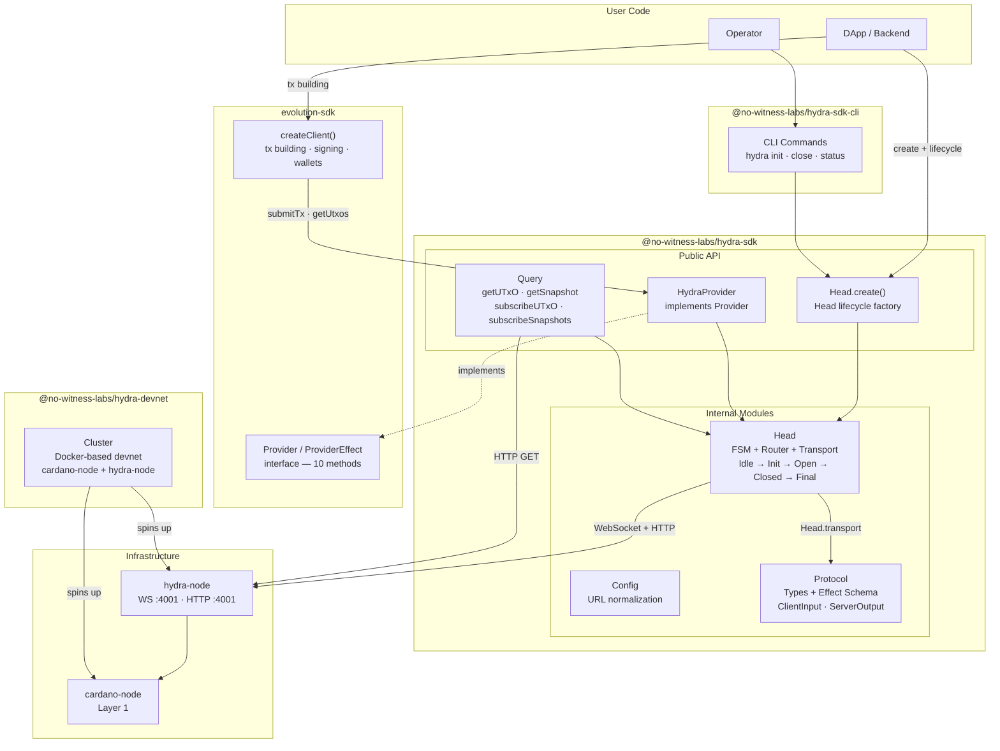

# Hydra SDK — Product Requirements Document

**Version:** 1.2
**Date:** February 26, 2026
**Author:** No Witness Labs
**Status:** Active

---

## Document History

| Version | Date              | Author             | Summary                                                                                                     |
| ------- | ----------------- | ------------------ | ----------------------------------------------------------------------------------------------------------- |
| 1.0     | February 16, 2026 | No Witness Labs    | Initial draft                                                                                               |
| 1.1     | February 26, 2026 | No Witness Labs    | Sync with GitHub issues: milestone status, CLI package rename, #9 superseded, #30 and #39 added to roadmap |
| 1.2     | February 26, 2026 | No Witness Labs    | PRD upgrade to skill schema: 5-section structure, removed implementation code samples, condensed Executive Summary, Testing Approach table, Appendix replaced with reference |

---

## 1. Executive Summary

### Problem Statement

Developers building on Cardano's Hydra Layer 2 must interact directly with a low-level WebSocket/HTTP JSON API exposed by the `hydra-node`. There is no production-grade TypeScript SDK that abstracts the Hydra Head protocol lifecycle, handles connection resilience, provides type-safe message schemas, or integrates with existing Cardano tooling (evolution-sdk, CIP-30 wallets). This forces every team to reimplement the same boilerplate: WebSocket management, message parsing, state machine tracking, and error handling.

### Proposed Solution

`@no-witness-labs/hydra-sdk` is a modular, type-safe TypeScript SDK that wraps the `hydra-node` WebSocket/HTTP API with Effect Schema-validated protocol types, a head lifecycle state machine, resilient connection management, a Query module for UTxO and snapshot data, and a `HydraProvider` that implements evolution-sdk's `Provider` / `ProviderEffect` interface — enabling existing evolution-sdk code to target Hydra L2 by swapping a single dependency, with no new transaction-building API to learn. A companion CLI package (`@no-witness-labs/hydra-sdk-cli`) handles operator-facing lifecycle management from the terminal; both the SDK and CLI expose every operation through a Promise API and an Effect API, following the Hybrid Effect API pattern.

### Success Criteria

| KPI | Target |
| ----------------------------------- | ------------------------------------------------------------------------------------------------------------------------------------------- |
| Protocol completeness | 100% of `ClientInput` (10 commands) + `ServerOutput` (32 events) typed and validated by Effect Schema |
| End-to-end lifecycle | Full lifecycle (Connect → Init → Commit → Open → NewTx → Close → Fanout) verified by integration tests against `@no-witness-labs/hydra-devnet` |
| Production resilience | `hydra-node` drop/restart triggers automatic SDK reconnection; head state consistent within 30 seconds |
| Cross-platform reach | Test suite passes on Chromium, Firefox, WebKit × Linux, macOS, Windows |
| Release readiness | npm package published with provenance attestation; Getting Started guide enables first working L2 transaction in < 30 minutes |

---

## 2. User Experience & Functionality

### User Personas

| Persona            | Description                                                   | Primary Need                                               |
| ------------------ | ------------------------------------------------------------- | ---------------------------------------------------------- |
| **DApp Developer** | Building Cardano apps that use Hydra for fast L2 transactions | Simple API to open heads, submit transactions, query state |
| **Hydra Operator** | Running `hydra-node` infrastructure for their team or users   | CLI tools and monitoring for head management               |
| **SDK Integrator** | Already using evolution-sdk and wants to add L2 support       | Drop-in provider that makes evolution-sdk work with Hydra  |

### User Stories

#### Story 1: Connect and manage a Hydra Head

> As a **DApp developer**, I want to connect to a Hydra node and manage the head lifecycle so that I can open a head, commit funds, transact at L2 speed, and close the head to settle back on L1.

**Acceptance Criteria:**

- `createHead({ url: 'ws://localhost:4001' })` establishes a WebSocket connection and returns a typed head instance
- `head.init()`, `head.commit(utxos)`, `head.close()`, `head.safeClose()`, `head.fanout()`, `head.abort()` execute lifecycle commands
- `head.subscribe(callback)` streams real-time state changes (`HeadIsInitializing`, `HeadIsOpen`, `HeadIsClosed`, etc.)
- `head.getState()` returns the current `HeadStatus` synchronously
- Both Promise and Effect APIs are available (`head.init()` and `head.effect.init()`)
- Connection auto-reconnects with exponential backoff on disconnect

#### Story 2: Submit L2 transactions via evolution-sdk

> As a **DApp developer**, I want to build and submit transactions inside an open Hydra Head using my existing evolution-sdk code so that I get near-instant confirmation without L1 fees and without learning a new API.

**Acceptance Criteria:**

- `Hydra.Provider.create(head)` returns a `Provider` / `ProviderEffect` that targets L2
- Plugging HydraProvider into `Evolution.createClient({ provider: hydraProvider, wallet })` gives a full tx builder targeting L2
- `submitTx()` sends the transaction via WebSocket `NewTx` message
- `TxValid` / `TxInvalid` responses are surfaced with typed error information
- `awaitTx(txHash)` resolves when the tx appears in a `SnapshotConfirmed` event
- Existing evolution-sdk tx building, signing, and UTxO selection work unchanged

#### Story 3: Query head state and UTxOs

> As a **DApp developer**, I want to query the current UTxO set and snapshot state of an open head so that I can display balances and build transactions.

**Acceptance Criteria:**

- `getUTxO()` returns the confirmed UTxO set
- `getSnapshot()` returns the latest confirmed snapshot
- `subscribeUTxO()`, `subscribeSnapshots()`, `subscribeTransactions()` provide real-time streaming via Effect PubSub (Effect API) or `AsyncIterableIterator` (Promise API)
- UTxO filtering by address is supported

#### Story 4: Use evolution-sdk against Hydra L2

> As an **SDK integrator**, I want to use my existing evolution-sdk code against a Hydra head by simply swapping the provider.

**Acceptance Criteria:**

- `HydraProvider` implements evolution-sdk's `Provider` interface (Promise API) and exposes `.Effect: ProviderEffect` (Effect API)
- Swapping to `HydraProvider` allows existing evolution-sdk code to target L2 with no other changes
- All 10 Provider methods are implemented: 7 fully supported, `getDelegation()` and `evaluateTx()` throw `ProviderError` (not applicable on L2), `getDatum()` is best-effort
- Provider swap workflow is documented (L1 → L2 → L1)

#### Story 5: Manage heads from the CLI

> As a **Hydra operator**, I want to connect to a node, inspect head status, and trigger lifecycle operations from the command line.

**Acceptance Criteria:**

- `hydra connect ws://node:4001` connects to a node
- `hydra status` shows current head state, participants, UTxO summary
- `hydra init`, `hydra close`, `hydra fanout` trigger lifecycle commands
- `--json` flag outputs machine-readable JSON
- Config precedence: CLI flags > env vars (`HYDRA_*`) > config file > defaults

#### Story 6: Resilient production deployment

> As a **DApp developer**, I want the SDK to handle network failures gracefully so that my application recovers without manual intervention.

**Acceptance Criteria:**

- Temporary disconnects trigger automatic reconnect with exponential backoff + jitter
- State is consistent after reconnection (replays history via `?history=yes`)
- `hydra-node` restart triggers SDK reconnect and state recovery
- Configurable retry policies (max retries, backoff factor, timeout)
- Connection health metrics are available

### Non-Goals

- **Running a `hydra-node`** — the SDK is a client, not a node implementation
- **Cardano L1 provider implementation** — L1 providers come from evolution-sdk
- **Custodial key management** — Hydra keys remain on the client side
- **Multi-head management per node** — single head per `hydra-node` (Hydra protocol constraint)
- **Protocol-level changes** — the SDK wraps the existing Hydra Head protocol as-is
- **Mobile-native SDKs** — TypeScript/JavaScript only (works in React Native via JS engine)

---

## 3. Technical Specifications

### Architecture Overview



### Module Breakdown

#### Protocol Module (`packages/hydra-sdk/src/Protocol/`)

**Purpose:** Type definitions and Effect Schema validators for all Hydra API messages.

**Coverage (from Hydra API v1.2.0):**

| Category                        | Messages                                                                                                                                                                                                                                                                                                                                                                                                                                                                                                                                                                                                                      |
| ------------------------------- | ----------------------------------------------------------------------------------------------------------------------------------------------------------------------------------------------------------------------------------------------------------------------------------------------------------------------------------------------------------------------------------------------------------------------------------------------------------------------------------------------------------------------------------------------------------------------------------------------------------------------------- |
| **ClientInput (10 commands)**   | `Init`, `Abort`, `NewTx`, `Recover`, `Decommit`, `Close`, `SafeClose`, `Contest`, `Fanout`, `SideLoadSnapshot`                                                                                                                                                                                                                                                                                                                                                                                                                                                                                                                |
| **ServerOutput (32 events)**    | `HeadIsInitializing`, `Committed`, `HeadIsOpen`, `HeadIsClosed`, `HeadIsContested`, `ReadyToFanout`, `HeadIsAborted`, `HeadIsFinalized`, `TxValid`, `TxInvalid`, `SnapshotConfirmed`, `SnapshotSideLoaded`, `DecommitRequested`, `DecommitApproved`, `DecommitFinalized`, `DecommitInvalid`, `CommitRecorded`, `CommitApproved`, `CommitFinalized`, `CommitRecovered`, `DepositActivated`, `DepositExpired`, `EventLogRotated`, `NetworkConnected`, `NetworkDisconnected`, `NetworkVersionMismatch`, `NetworkClusterIDMismatch`, `PeerConnected`, `PeerDisconnected`, `IgnoredHeadInitializing`, `NodeUnsynced`, `NodeSynced` |
| **Greetings (connection)**      | `Greetings` — separate message type sent on WebSocket connect (contains `me`, `headStatus`, `hydraHeadId`, `snapshotUtxo`, `hydraNodeVersion`, `env`, `networkInfo`, `chainSyncedStatus`, `currentSlot`)                                                                                                                                                                                                                                                                                                                                                                                                                      |
| **ClientMessage (errors)**      | `CommandFailed`, `PostTxOnChainFailed`, `RejectedInputBecauseUnsynced`, `SideLoadSnapshotRejected`                                                                                                                                                                                                                                                                                                                                                                                                                                                                                                                            |
| **InvalidInput (parse errors)** | `InvalidInput` — separate message type sent when WebSocket input cannot be decoded (contains `reason`, `input`)                                                                                                                                                                                                                                                                                                                                                                                                                                                                                                               |
| **Domain types**                | `HeadId`, `HeadSeed`, `Party`, `Snapshot`, `SnapshotNumber`, `UTxO`, `TxIn`, `TxOut`, `Transaction`, `Value`, `Address`, `HeadStatus`, `HeadState`, `ContestationPeriod`, `ProtocolParameters`                                                                                                                                                                                                                                                                                                                                                                                                                                |

#### Transport Layer (`packages/hydra-sdk/src/Head/Head.transport.ts` — internal)

**Purpose:** WebSocket connection management with resilience, embedded in the Head module.

**Capabilities:**

- Connect to `hydra-node` WebSocket (`ws://` or `wss://`)
- Send typed `ClientInput` commands
- Receive and parse `ServerOutput` / `ClientMessage` / `Greetings` / `InvalidInput` events
- Automatic reconnection with exponential backoff + jitter (configurable via `HeadConfig.reconnect`)
- Query parameter configuration: `?history=yes|no`
- Browser (native `WebSocket`) and Node.js (`ws` via `@effect/platform`) compatibility
- Generation counter tracking reconnection cycles

#### Head Module (`packages/hydra-sdk/src/Head/`)

**Purpose:** State machine, command routing, transport, and the `Head.create()` factory.

**Internal components:**

- **FSM** — transition table and command guards with `Ref`-based status
- **Router** — send-and-await pattern with `Deferred`-based matching
- **Transport** — WebSocket lifecycle, reconnection, event parsing

**States:** `Idle` → `Initializing` → `Open` → `Closed` → `FanoutPossible` → `Final`

**Also handles:** `Idle` → `Initializing` → `Aborted` (abort path)

**Transitions driven by:** `ServerOutput` events from the WebSocket

**Required commands:** `init`, `commit`, `close`, `safeClose`, `fanout`, `abort`, `submitTx` (NewTx), `recover`, `decommit`, `contest`

#### `Head.create()` Factory

**Purpose:** Primary entry point for head lifecycle management. Exposes four API surfaces — Promise, Effect namespace, scoped Effect, and Effect Layer — to suit usage patterns from simple scripts to production applications.

**Resource management:** `create()` acquires a WebSocket connection. Cleanup via:

- `head.dispose()` / `Symbol.asyncDispose` — manual close (Promise API, long-lived)
- `withHead(config, body)` — bracket pattern (Promise API, scoped)
- `effect.createScoped(config)` — `acquireRelease` (Effect API, **recommended**)
- `layer(config)` — Layer lifecycle (Effect DI, **recommended for production**)

#### Query Module (`packages/hydra-sdk/src/Query/`)

**Purpose:** Read-only queries and streaming subscriptions.

| Function                  | Source                        | Description                           |
| ------------------------- | ----------------------------- | ------------------------------------- |
| `getUTxO()`               | `GET /snapshot/utxo`          | Current confirmed UTxO set            |
| `getSnapshot()`           | `GET /snapshot`               | Latest confirmed snapshot             |
| `getHeadState()`          | `GET /head`                   | Current head state detail             |
| `getProtocolParameters()` | `GET /protocol-parameters`    | Cardano protocol params               |
| `getPendingDeposits()`    | `GET /commits`                | Pending deposit tx IDs                |
| `getSeenSnapshot()`       | `GET /snapshot/last-seen`     | Latest seen (unconfirmed) snapshot    |
| `getHeadInitialization()` | `GET /head-initialization`    | Timestamp of last head initialization |
| `subscribeUTxO()`         | WebSocket `SnapshotConfirmed` | Stream UTxO changes                   |
| `subscribeSnapshots()`    | WebSocket `SnapshotConfirmed` | Stream confirmed snapshots            |
| `subscribeTransactions()` | WebSocket `TxValid`           | Stream transaction confirmations      |

**Streaming in Promise API:** `AsyncIterableIterator<T>`
**Streaming in Effect API:** `Stream.Stream<T, E>`

#### HydraProvider (`packages/hydra-sdk/src/Provider/`)

**Purpose:** evolution-sdk `Provider` / `ProviderEffect` adapter targeting Hydra L2.

evolution-sdk uses a dual API pattern: each provider class implements `Provider` (Promise-based) and exposes a `.Effect: ProviderEffect` property (Effect-based, 10 methods). HydraProvider follows this same pattern, aligning with the SDK's Hybrid Effect API architecture.

Maps evolution-sdk Provider interface methods to Hydra APIs:

| Provider Method                   | Hydra Implementation                              | Notes                                                                                                               |
| --------------------------------- | ------------------------------------------------- | ------------------------------------------------------------------------------------------------------------------- |
| `getProtocolParameters()`         | `GET /protocol-parameters`                        | Fully supported — returns Cardano protocol params used by L2 ledger                                                 |
| `getUtxos(address)`               | `GET /snapshot/utxo` (filtered by address)        | Fully supported — filters confirmed snapshot UTxO                                                                   |
| `getUtxosWithUnit(address, unit)` | `GET /snapshot/utxo` (filtered by address + unit) | Fully supported — additional client-side asset filtering                                                            |
| `getUtxoByUnit(unit)`             | `GET /snapshot/utxo` (filtered by unit)           | Fully supported — scan confirmed UTxO for specific asset                                                            |
| `getUtxosByOutRef(outRefs)`       | `GET /snapshot/utxo` (filtered by OutRef)         | Fully supported — client-side OutRef matching                                                                       |
| `getDelegation(rewardAddress)`    | N/A                                               | **Not supported on L2** — delegation/staking is L1-only. Returns empty/throws `ProviderError`                       |
| `getDatum(datumHash)`             | `GET /snapshot/utxo` (scan for datum hash)        | **Best-effort** — can scan UTxO for inline datums; datum-hash-only UTxOs may not be fully resolvable on L2          |
| `awaitTx(txHash, checkInterval?)` | WebSocket `SnapshotConfirmed`                     | Fully supported — resolves when tx appears in a confirmed snapshot                                                  |
| `submitTx(tx)`                    | WebSocket `NewTx` or `POST /transaction`          | Fully supported — submits signed tx to head                                                                         |
| `evaluateTx(tx)`                  | N/A                                               | **Not supported on L2** — Hydra has no tx evaluation endpoint. Returns estimated ex-units or throws `ProviderError` |

#### CLI Package (`packages/hydra-sdk-cli/`)

**Purpose:** Operator CLI using `@effect/cli`.

| Command                    | Description                                 |
| -------------------------- | ------------------------------------------- |
| `hydra connect <url>`      | Connect to a hydra-node                     |
| `hydra status`             | Show head state, participants, UTxO summary |
| `hydra init`               | Initialize a new head                       |
| `hydra commit <utxo-file>` | Commit UTxOs to initializing head           |
| `hydra close`              | Close the head                              |
| `hydra fanout`             | Fan out after contestation                  |
| `hydra abort`              | Abort before all commits                    |
| `hydra config`             | Show/set configuration                      |

Config precedence: CLI flags > `HYDRA_*` env vars > `~/.config/hydra-sdk/config.json` > defaults

### Hydra Node API Mapping

The SDK wraps both WebSocket and HTTP interfaces of the `hydra-node` (API v1.2.0):

**WebSocket (`ws://{host}:{port}/`):**

| Direction     | Operation                                        | SDK Method                                |
| ------------- | ------------------------------------------------ | ----------------------------------------- |
| PUB (send)    | `Init`                                           | `head.init()`                             |
| PUB           | `Abort`                                          | `head.abort()`                            |
| PUB           | `NewTx`                                          | `head.submitTx()` / `provider.submitTx()` |
| PUB           | `Recover`                                        | `head.recover(txId)`                      |
| PUB           | `Decommit`                                       | `head.decommit(tx)`                       |
| PUB           | `Close`                                          | `head.close()`                            |
| PUB           | `SafeClose`                                      | `head.safeClose()`                        |
| PUB           | `Contest`                                        | `head.contest()`                          |
| PUB           | `Fanout`                                         | `head.fanout()`                           |
| PUB           | `SideLoadSnapshot`                               | `head.sideLoadSnapshot(snapshot)`         |
| SUB (receive) | `Greetings`                                      | Connection metadata                       |
| SUB           | `HeadIsInitializing`                             | State transition event                    |
| SUB           | `Committed`                                      | State transition event                    |
| SUB           | `HeadIsOpen`                                     | State transition event                    |
| SUB           | `HeadIsClosed`                                   | State transition event                    |
| SUB           | `HeadIsContested`                                | State transition event                    |
| SUB           | `ReadyToFanout`                                  | State transition event                    |
| SUB           | `HeadIsAborted`                                  | State transition event                    |
| SUB           | `HeadIsFinalized`                                | State transition event                    |
| SUB           | `TxValid` / `TxInvalid`                          | Transaction result                        |
| SUB           | `SnapshotConfirmed`                              | Snapshot finality                         |
| SUB           | `Decommit*` events                               | Decommit lifecycle                        |
| SUB           | `Commit*` events                                 | Incremental commit lifecycle              |
| SUB           | `Network*` / `Peer*`                             | Network health                            |
| SUB           | `NodeUnsynced` / `NodeSynced`                    | Node sync status                          |
| SUB           | `CommandFailed` / `RejectedInputBecauseUnsynced` | Error handling                            |

**HTTP (`http://{host}:{port}/`):**

| Method   | Path                   | SDK Method                                    |
| -------- | ---------------------- | --------------------------------------------- |
| `GET`    | `/head`                | `query.getHeadState()`                        |
| `GET`    | `/snapshot`            | `query.getSnapshot()`                         |
| `GET`    | `/snapshot/utxo`       | `query.getUTxO()`                             |
| `GET`    | `/snapshot/last-seen`  | `query.getSeenSnapshot()`                     |
| `GET`    | `/protocol-parameters` | `query.getProtocolParameters()`               |
| `GET`    | `/commits`             | `query.getPendingDeposits()`                  |
| `GET`    | `/head-initialization` | `query.getHeadInitialization()`               |
| `POST`   | `/commit`              | `head.commit(utxo)` (draft commit tx)         |
| `POST`   | `/decommit`            | `head.decommit(tx)`                           |
| `POST`   | `/transaction`         | `head.submitTx(tx)` / `provider.submitTx(tx)` |
| `POST`   | `/cardano-transaction` | internal (`head.commit()` flow)               |
| `POST`   | `/snapshot`            | `head.sideLoadSnapshot(req)`                  |
| `DELETE` | `/commits/{tx-id}`     | `head.recover(txId)`                          |

### Integration Points

| System         | Integration                     | Method                                         |
| -------------- | ------------------------------- | ---------------------------------------------- |
| `hydra-node`   | WebSocket + HTTP API            | Primary interface                              |
| evolution-sdk  | `HydraProvider` + L1 providers  | Transaction building                           |
| CIP-30 wallets | Via evolution-sdk wallet module | Transaction signing (Nami, Eternl, Lace, etc.) |
| Cardano L1     | Via evolution-sdk providers     | Blockfrost, Kupmios, Koios, Maestro            |

### Integration Architecture: hydra-sdk ↔ evolution-sdk

#### Dependency Strategy

The dependency is strictly **one-directional**: hydra-sdk depends on evolution-sdk, never the reverse. evolution-sdk has zero knowledge of hydra-sdk, making circular dependencies impossible.

```
evolution-sdk (defines interfaces + domain types)
      ▲
      │ peerDependency (optional)
      │
hydra-sdk (implements Provider, uses Schema transforms)
```

evolution-sdk is declared as an **optional peer dependency**. The core SDK modules (Protocol, Socket, Head, Query) work without evolution-sdk installed. Only the `Provider` module requires it.

#### Two Type Universes

hydra-sdk maintains **two separate type universes** connected by schema transforms:

| Universe | Owner | Purpose | Examples |
|---|---|---|---|
| **Wire types** | hydra-sdk (`Protocol/Types.ts`) | Model hydra-node JSON wire format, validated by Effect Schema | `HydraUTxOSchema`, `HydraValueSchema`, `HydraTxOutSchema` |
| **Domain types** | evolution-sdk | Model Cardano data at a higher level, used by tx builders & wallets | `UTxO`, `Value`, `Assets`, `ProtocolParameters` |

hydra-sdk **never re-exports** evolution-sdk types from its public namespace. evolution-sdk types only appear at the `Provider` boundary.

#### Schema Transforms (wire ↔ domain)

Schema transforms (`Schema.transform` / `Schema.transformOrFail` in `Protocol/Types.ts`) decode hydra wire JSON directly into evolution-sdk domain types in a single step, with no intermediate adapter layer. This gives bidirectional encoding (encode for `submitTx` / `NewTx`), schema-validated structured errors, and full composability with other Schema operations.

#### Subpath Exports

The Provider module is exposed via a subpath export (`@no-witness-labs/hydra-sdk/provider`) so users who do not need evolution-sdk integration do not pay for it.

### Security & Privacy

- **No custodial keys:** Hydra signing keys remain client-side. The SDK never stores or transmits private keys
- **TLS support:** `wss://` and `https://` for encrypted node communication (configured via `hydra-node` `--tls-cert` / `--tls-key`)
- **API unauthenticated:** The `hydra-node` API has no built-in auth. Users must secure access via network-level controls (firewall, VPN, reverse proxy). The SDK documents this clearly
- **Input validation:** All received messages validated against Effect Schema before processing — prevents malformed data from corrupting state
- **No telemetry:** SDK collects zero usage data

### Error Handling

All errors extend `Data.TaggedError` from Effect (`SocketError`, `HeadError`, `ProtocolError`). The Effect API surfaces errors in the type signature; the Promise API throws them, documented with `@throws` JSDoc. The full error taxonomy and Hybrid API implementation rules are defined in [hybrid-effect-api.instructions.md](/.github/instructions/hybrid-effect-api.instructions.md).

### Technology Stack

| Component         | Technology                                    | Rationale                                                                                 |
| ----------------- | --------------------------------------------- | ----------------------------------------------------------------------------------------- |
| Language          | TypeScript 5.9+ (strict mode)                 | Type safety, ecosystem                                                                    |
| Runtime           | ES2022, ESM-only                              | Modern targets, no CJS legacy                                                             |
| Effect library    | Effect                                        | Composition, error handling, DI (per Hybrid API pattern)                                  |
| Schema validation | `effect/Schema`                               | Runtime type validation for protocol messages (part of main `effect` package since v3.10) |
| WebSocket         | Native `WebSocket` (browser) / `ws` (Node.js) | Cross-platform                                                                            |
| Cardano tooling   | evolution-sdk                                 | L1 providers, wallet integration, tx building                                             |
| CLI framework     | `@effect/cli`                                 | Declarative CLI with Effect integration                                                   |
| Monorepo          | pnpm workspaces + Turborepo                   | Fast builds, caching                                                                      |
| Testing           | Vitest + Playwright                           | Unit + cross-browser testing                                                              |
| Documentation     | Fumadocs                                      | MDX docs with Twoslash code examples                                                      |
| Versioning        | Changesets                                    | Automated releases                                                                        |
| CI/CD             | GitHub Actions                                | Build, test, publish pipeline                                                             |

### Platform Requirements

| Platform | Requirement                                                |
| -------- | ---------------------------------------------------------- |
| Node.js  | >= 20                                                      |
| Browsers | Chromium (latest-1), Firefox (latest-1), WebKit (latest-1) |
| OS       | Linux, macOS, Windows                                      |

---

## 4. Risks & Roadmap

### Phased Rollout

#### Milestone 1 — Foundation

**Goal:** Core infrastructure, protocol types, WebSocket layer, head state machine, devnet testing infrastructure.

| Deliverable                                               | Issue |
| --------------------------------------------------------- | ----- |
| Package structure & build config                          | #2    |
| Protocol module — message types & schemas (initial)       | #3    |
| Transport layer — WebSocket communication                 | #4    |
| Head state machine (internal)                             | #5    |
| `Head.create()` factory function                          | #6    |
| All Head commands (lifecycle + tx operations)             | #6    |
| Protocol module — schema refinements (optional fields, UTxO types, typed failures, negative tests) | #30   |
| Documentation site setup                                  | #7    |

> **hydra-devnet:** Integration tests run against `@no-witness-labs/hydra-devnet`, which provides a Docker-based Cardano + Hydra L2 devnet. The devnet module handles key generation, genesis configuration, script publishing, and full cluster orchestration.

#### Milestone 2 — Transaction & Query Layer

**Goal:** Query module, complete head commands, examples, integration tests.

> **Note:** The originally planned `createClient()` factory in hydra-sdk was superseded. The unified L2 transaction API is achieved via `Head.create()` + `HydraProvider` (see M3 #15). L2 transaction pattern documentation is tracked in #13.

| Deliverable                                             | Issue |
| ------------------------------------------------------- | ----- |
| Query module — head state & UTxO queries with streaming | #8    |
| Per-command failure matching in Head command router     | #39   |
| Example projects (transfer, mint/burn, state update)    | #10   |
| CLI package setup with @effect/cli                      | #11   |
| Complete head lifecycle integration tests               | #12   |

#### Milestone 3 — Integration & Resilience

**Goal:** evolution-sdk integration, cross-platform testing, production resilience.

| Deliverable                                           | Issue |
| ----------------------------------------------------- | ----- |
| Provider integration documentation                    | #13   |
| Cross-browser & cross-platform testing suite          | #14   |
| HydraProvider — evolution-sdk provider implementation | #15   |
| Connection resilience & recovery                      | #16   |

#### Milestone 4 — Release & Documentation

**Goal:** npm publish, complete docs, grant closeout.

| Deliverable            | Issue |
| ---------------------- | ----- |
| npm release automation | #17   |
| Complete documentation | #18   |
| Grant closeout report  | #19   |

#### Future — hydra-manager-sdk

Multi-head orchestration across multiple `hydra-node` instances. Out of scope for the current Catalyst Fund 13 grant cycle (Milestones 1–4). Tracked in #23 for post-M4 definition.

| Deliverable                                  | Issue |
| -------------------------------------------- | ----- |
| hydra-manager-sdk (multi-head orchestration) | #23   |

**Proposed scope:** multi-head connection pooling, cross-head state aggregation, operator-facing management dashboard support.

### Technical Risks

| Risk                                         | Impact                                                                                               | Likelihood | Mitigation                                                                                |
| -------------------------------------------- | ---------------------------------------------------------------------------------------------------- | ---------- | ----------------------------------------------------------------------------------------- |
| **Hydra API breaking changes**               | Protocol module requires updates                                                                     | Medium     | Pin to specific `hydra-node` version in tests; Schema validation catches mismatches early |
| **evolution-sdk Provider interface changes** | HydraProvider adapter breaks                                                                         | Low        | Depend on stable evolution-sdk version; integration tests in CI                           |
| **WebSocket reliability in browsers**        | Dropped connections lose state                                                                       | Medium     | Exponential backoff + history replay on reconnect; offline queue for pending ops          |
| **Hydra protocol limitations**               | SDK cannot work around protocol constraints (single head per node, static topology, training wheels) | N/A        | Document clearly in "Limits" guide; set user expectations                                 |
| **Cross-browser WebSocket differences**      | Safari/Firefox edge cases                                                                            | Low        | Playwright test matrix across Chromium/Firefox/WebKit                                     |
| **Large UTxO sets**                          | Memory pressure in browser                                                                           | Low        | Pagination support; streaming instead of full materialization                             |

### Dependencies

| Dependency                                    | Version                         | Purpose                                              |
| --------------------------------------------- | ------------------------------- | ---------------------------------------------------- |
| `hydra-node`                                  | >= 1.0.0 (tested against 1.2.0) | Target node API version                              |
| `effect`                                      | >= 3.10                         | Core runtime incl. `effect/Schema` (peer dependency) |
| `@effect/cli`                                 | >= 0.x                          | CLI framework                                        |
| evolution-sdk (`@intersectmbo/evolution-sdk`) | TBD                             | L1 providers + wallet + tx building                  |

### Testing Approach

| Layer         | Tool                         | Scope                                                                         |
| ------------- | ---------------------------- | ----------------------------------------------------------------------------- |
| Unit          | Vitest                       | Protocol schema validation, FSM transitions, Socket reconnection              |
| Integration   | Vitest + hydra-devnet        | Full head lifecycle, multi-party heads, reconnection, L1↔L2 commit/fanout    |
| Cross-browser | Playwright                   | Chromium, Firefox, WebKit — WebSocket connection, wallet extension interaction |
| Platform      | CI matrix                    | Linux, macOS, Windows                                                         |
| Testnet       | Manual + CI                  | Transfer, Mint/Burn, State Update on Cardano `preview`                        |

> **Architectural reference:** All SDK modules follow the Hybrid Effect API pattern (Promise API + Effect API, four surfaces per module). Full implementation rules are defined in [hybrid-effect-api.instructions.md](/.github/instructions/hybrid-effect-api.instructions.md).
