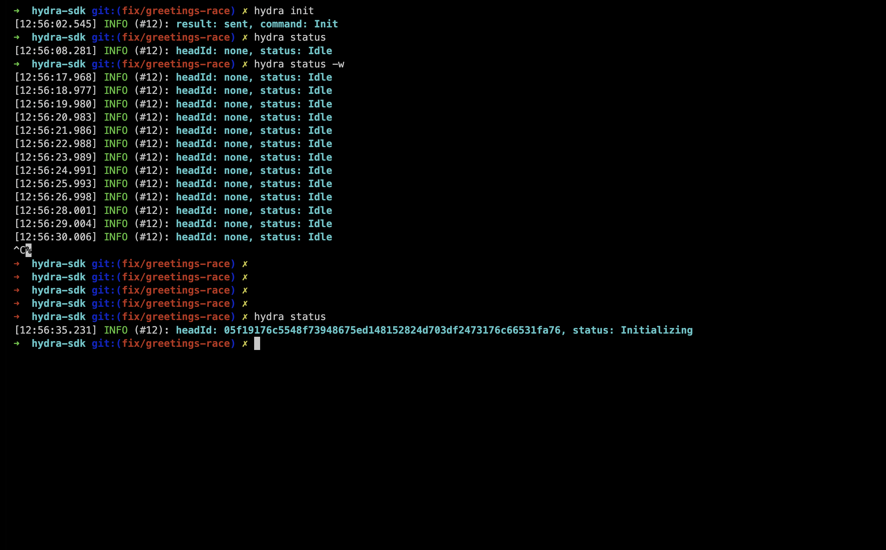
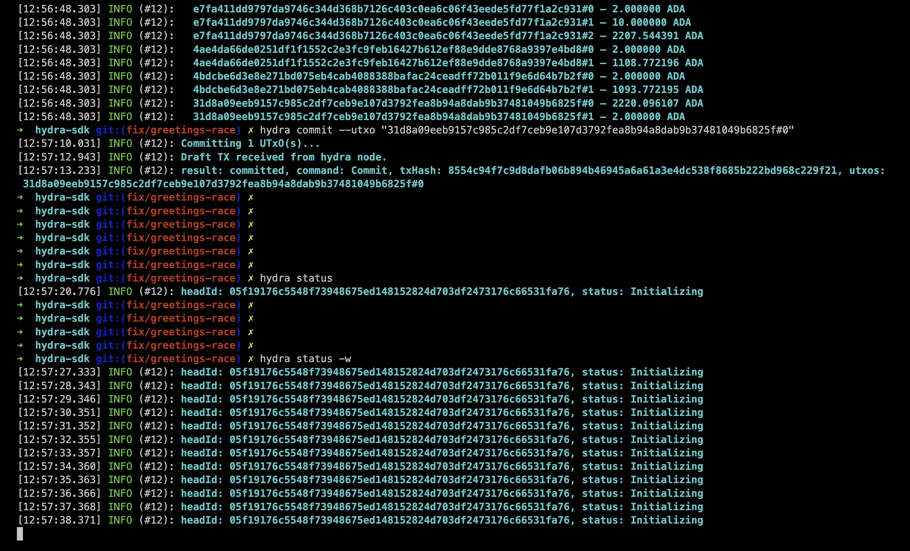
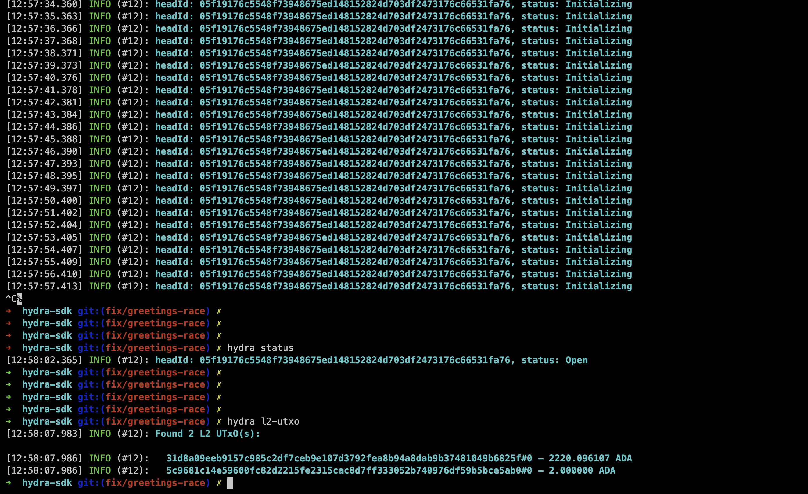
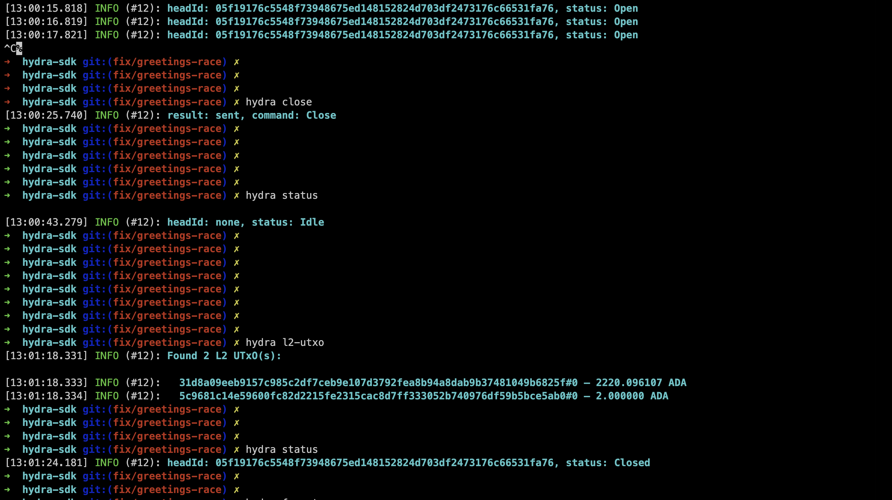
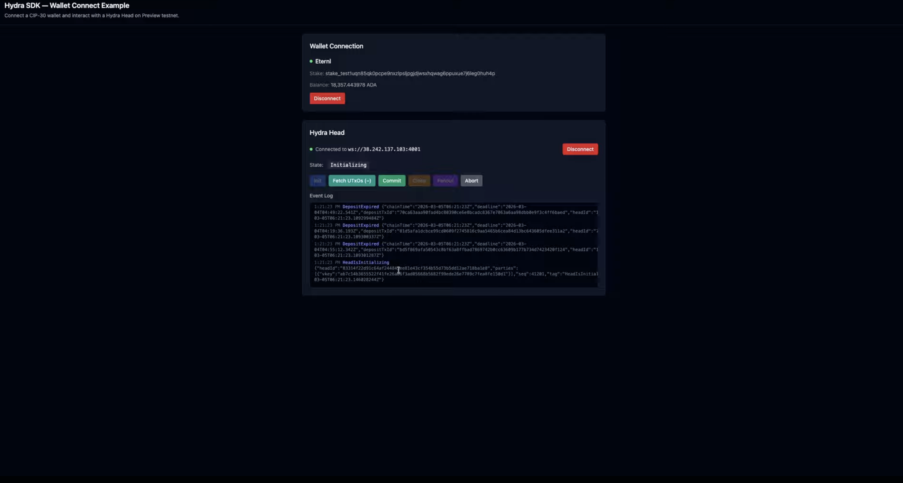
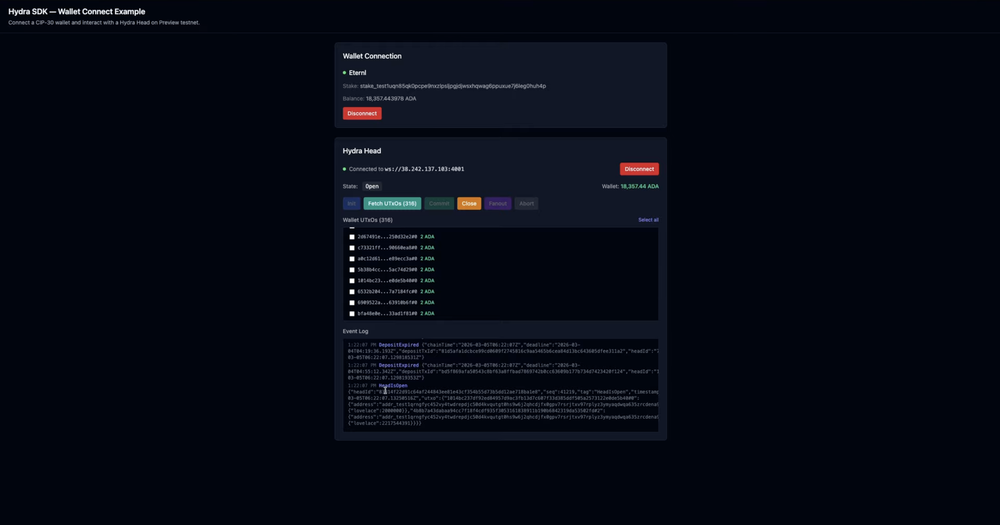
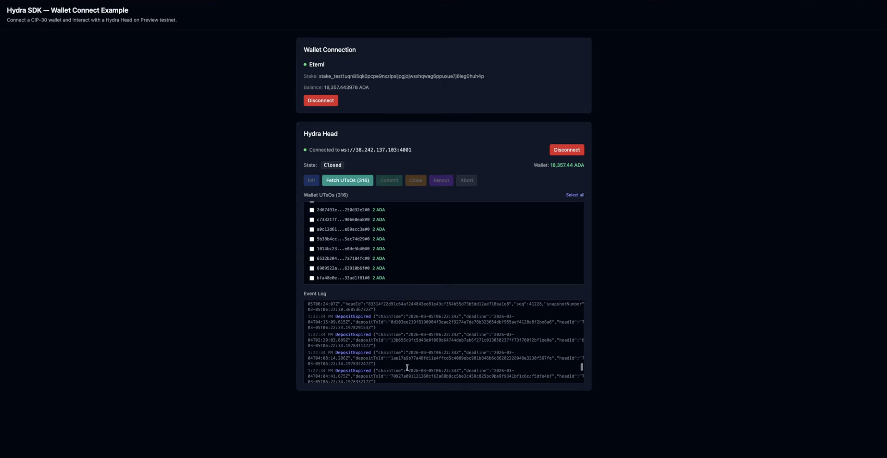

# Milestone 1 - Evidence of Completion

**Project:** Hydra SDK (Project Catalyst #1400085)
**Milestone:** 1
**Repository:** https://github.com/no-witness-labs/hydra-sdk
**Tag:** v0.1.0

## Overview

The Hydra SDK provides a TypeScript SDK and CLI for managing Hydra Head lifecycle on Cardano. This milestone demonstrates the core open/close flow working both in the browser (React example app) and via the CLI.

## Evidence

### Video Demo

- YouTube demo: https://www.youtube.com/watch?v=kyO6wsSYY7k
- CLI terminal recording: https://asciinema.org/a/akYcaOZldCxsXWNr

### Documentation

- Documentation site: https://nowitnesslabs.github.io/hydra-manager/docs/

### Screenshots - CLI Flow

The CLI (`hydra` command) manages the full Hydra Head lifecycle on Preprod testnet.

#### 1. Init



`hydra init` sends the Init command to the hydra-node. `hydra status` confirms the head transitions to **Initializing** state with a head ID assigned.

#### 2. Initializing (Commit)



`hydra commit` commits wallet UTxOs to the head. The CLI builds a blueprint transaction, posts to the hydra-node `/commit` endpoint, signs the draft TX, and submits to L1 via Blockfrost. `hydra status -w` watches the state in real-time.

#### 3. Open



After all participants commit, the head transitions to **Open**. `hydra l2-utxo` shows the committed UTxOs now available inside the L2 head.

#### 4. Close



`hydra close` initiates head closure. After the contestation period, the head transitions to **Closed**. L2 UTxOs are preserved and will be fanned out to L1.

### Screenshots - Web App Flow (with-vite-react)

The example React app (`examples/with-vite-react`) connects a CIP-30 wallet to a Hydra Head on Preprod testnet.

#### 1. Init (Web)



The web app shows the head in **Initializing** state after init, with real-time event log displaying `HeadIsInitializing` and related events.

#### 2. Open (Web)



Head transitions to **Open** after commit. The app displays wallet UTxOs inside the head (L2), total head value, and provides buttons for Close, Fanout, and Abort operations.

#### 3. Close (Web)



Head in **Closed** state after close. The contestation period is active. The event log shows the `HeadIsClosed` event and subsequent `ReadyToFanout` events.

## Repository Structure

```
hydra-sdk/
  packages/
    hydra-sdk/          # Core TypeScript SDK
    hydra-sdk-cli/      # CLI tool (hydra command)
  examples/
    with-vite-react/    # React example app with CIP-30 wallet
```

## Key Features Demonstrated

- WebSocket connection to hydra-node with automatic reconnection
- Full head lifecycle: Init -> Commit -> Open -> Close -> Fanout
- CLI with config management (`hydra config set/get/list`)
- Interactive TUI (`hydra tui`) with real-time monitoring
- L1 and L2 UTxO querying
- Wallet-based UTxO commit with Blockfrost integration
- React example app with CIP-30 wallet integration
- Event-driven state machine tracking all hydra-node protocol events
